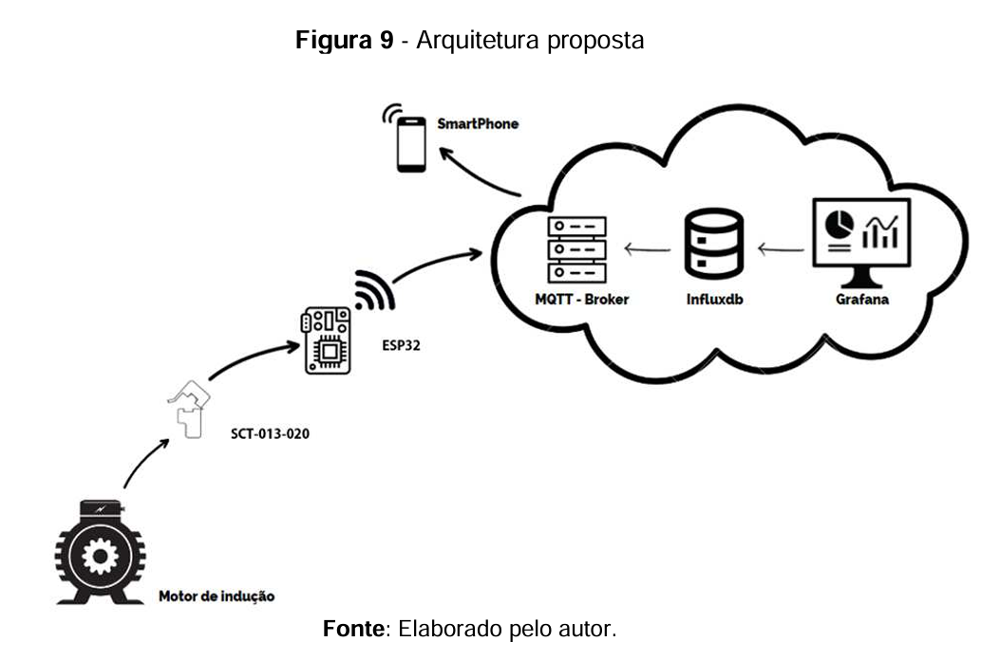

# IC
Códigos da IC em análise de vibrações

## Próximos passos:

### Definição do tipo de medição:

### Criação do servidor para hospedar os serviços que serão utilizados:
* Grafana;
* InfluxDB;
* Mosquitto;

## Topologia de Construção:

### Comunicação:

- Configurar MQTT;
- Configurar Grafana;
- Configurar InfluxDB;
